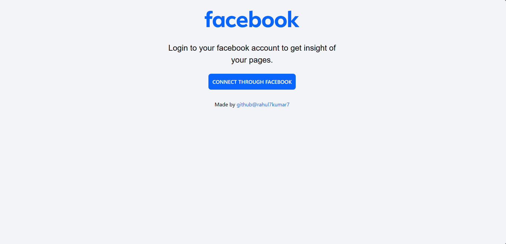
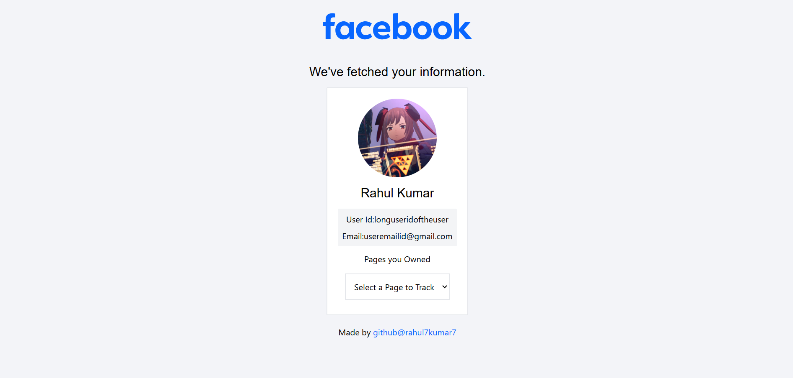
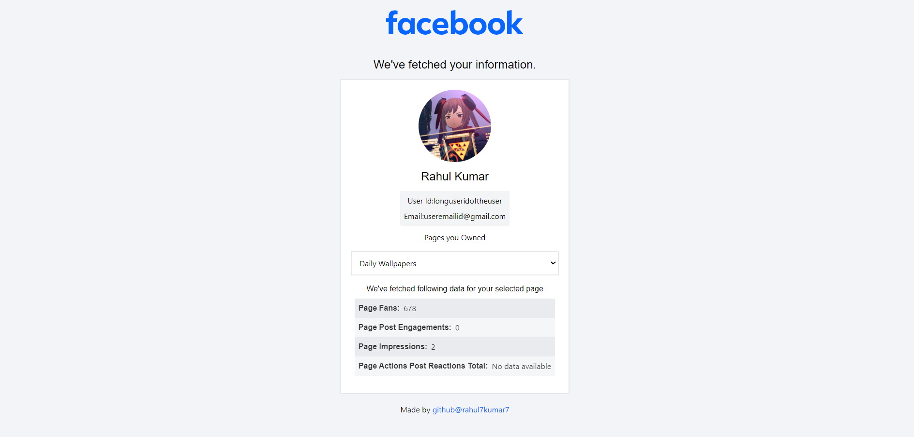

A simple React based web app that utilizes Facebook Graph API to access user data and return their Page insight.

Features:
- Fetching data from Facebook using SDK.
- Displaying user profile pciture, name and id on the main page.
- Displaying facebook pages and their insights.
- Responsive layout.
- Made with React and Tailwind CSS.

Screenshots:

How to use:
- Clone the repo
- Enter client folder using `cd client`
- Install the dependencies `npm i`
- Start the server `npm start`
